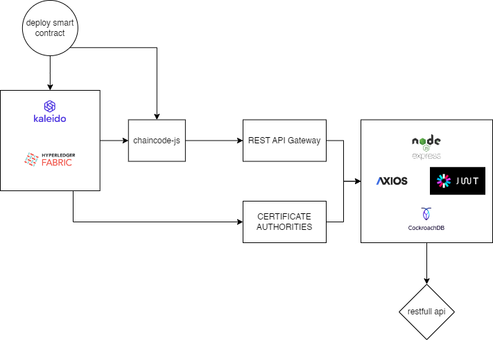

# REST API Documentation



This is a RESTful API built with Node.js.

## Getting Started

To use this API, follow these steps:

1. Clone the repository:

   ```bash
   git clone https://github.com/Alien-404/ojk-api-scc.git
   ```

2. Install the required dependencies:

   ```bash
   npm install
   ```

3. Start the server:

   ```bash
   npm start
   ```

## **Create Account and Certificate**

To create an account and certificate, you will need to provide the required data. Please refer to the validation file for details:

- [Validation Data](https://github.com/Alien-404/ojk-api-scc.git/src/utils/validations)

## **Documentation and Configuration**

- To view the list of available routes and documentation, visit [http:localhost:8080:/doc](http:localhost:8080:/doc).
- For **[.env]** environment-related configurations, please refer to the Discord channel in the **be_config** channel.
